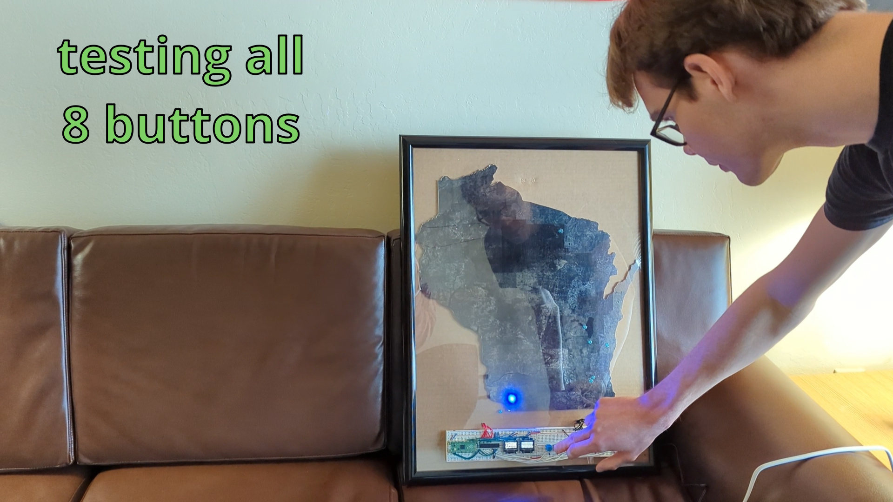
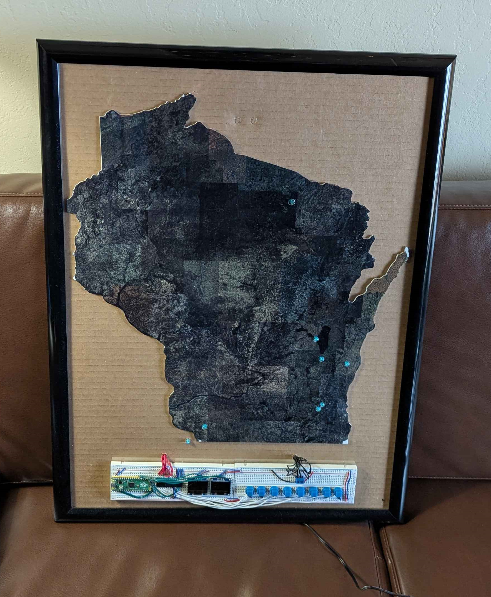
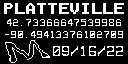
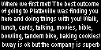
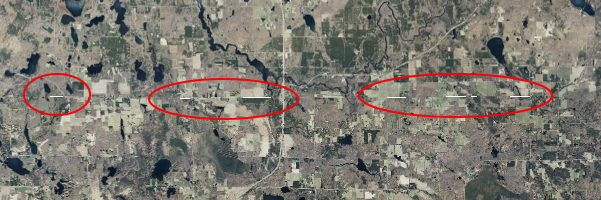

# Wisconsin LED Map

## The Main Idea

The goal of this project was to create a map of Wisconsin that contains several LEDs placed at specific locations. These
LEDs would be turned on by corresponding buttons at the base of the map, and a brief info blurb about the location of
the LED would be displayed on small display next to the buttons. This was designed to be an anniversary gift and was
inspired by similar systems at museums used to interact with large maps or model cities.

## Demo

Below is a video of the map in action. The map is plugged in, some buttons are pressed to light up the corresponding
LEDs and show the info on the OLED displays, and the easter egg is activated.
 
 

## Hardware

### Parts List

1. White acrylic sheet [($30-50)](https://www.homedepot.com/p/Falken-Design-24-in-x-36-in-x-1-8-in-Thick-Acrylic-White-Opaque-7508-Sheet-Falken-Design-ACRYLIC-WT-7508-1-8-2436/308669163)
2. Picture Frame [($8)](https://www.walmart.com/ip/Mainstays-18-x24-Black-Basic-Poster-Wall-Frame/16783460)
3. Raspberry Pi Pico [($10)](https://www.amazon.com/KEYESTUDIO-Raspberry-Starter-Headers-Breadboard/dp/B0861WJ2DD)
4. SSD1306 OLED Displays [($15)](https://www.amazon.com/Hosyond-Display-Self-Luminous-Compatible-Raspberry/dp/B09T6SJBV5/ref=sr_1_1_sspa)
5. MCP23017 I/O Multiplexer [($2)](https://www.digikey.com/en/products/detail/microchip-technology/MCP23017-E-SP/894272)
6. Blue LEDs [($3)](https://www.digikey.com/en/products/detail/everlight-electronics-co-ltd/5484BN-BADC-AGJA-PR-MS/4950440)
7. Blue Push Buttons [($12)](https://www.digikey.com/en/products/detail/c-k/D6C60-F1-LFS/1466325)
8. Breadboards [($9)](https://www.amazon.com/EL-CP-003-Breadboard-Solderless-Distribution-Connecting/dp/B01EV6LJ7G/ref=sr_1_1_sspa)
9. Electrical Wire [($17)](https://www.amazon.com/TUOFENG-Wire-Solid-different-colored-spools/dp/B085QD9DWP/ref=sr_1_2)
10. Solder Wire [($9)](https://www.amazon.com/MAIYUM-63-37-Solder-Electrical-Soldering/dp/B075WB98FJ/ref=sr_1_2)

Total: $115-135
 
_Prices updated February 2025_

### Assembly

    
    

    

## Software

### Overview

A core feature of this project was the map itself, or rather the image used for the map. The plan was to use the UV printer
at UW-Platteville to print a satellite view of Wisconsin onto a sheet of acrylic. However, this required a large satellite
image, able to be blown up to roughly 18x24" without noticeably losing quality. After browsing for an existing image was
deemed unfruitful, the project was divided into two main tasks: (1) programming the Pico to work with the buttons, LEDs, and
displays, and (2) ripping a super high-resolution satellite image of Wisconsin from an existing satellite imagery service.

### Wisconsin Satellite Image

Originally, the plan to create a custom super high-resolution satellite image of Wisconsin involved using a form of web
scraping to take images from sites like Google Maps. At the time, Google Maps was abandoned due to its confusing URL
structure and watermarking. _Upon reviewing the URL structure later, however, it appears to be much simpler than the
alternative site which ended up being used instead_. The alternative ended up being the Wisconsin Department of Natural
Resources, or rather their "Wisconsin Leaf-Off Digital Orthophoto Web Map" which can be found [here](https://data-wi-dnr.opendata.arcgis.com/maps/a31d6f2d3b1542d699a1bf90c077b330/explore).
Somewhat accidentally, an API for the imagery dataset used in this map was found [here](https://dnrmaps.wi.gov/arcgis_image/rest/services/DW_Imagery/EN_Image_Basemap_Latest_Leaf_Off_Index/MapServer/export). After researching some mapping terms and engaging in much trial and error, it was determined that this API could
export up to about 4000x4000-pixel stitches of the leaf-off imagery at any zoom level. Therefore, the new strategy would
be to divide Wisconsin into some grid, download the images for each grid cell, and then stitch all these cells together.
For simplicity, a 10x10 grid was chosen, meaning 100 images would be downloaded from the API and stitched together using
a Python script. The `downloader.py` script was used to download the grid images, and then the `stitcher.py` script was
used to stitch them into one contiguous image. PaintDotNet was also used to clean up the edges of the final image and add
in the missing parts of Lake Winnebago. For the sake of not overloading the UV printer, a total resolution of 10000x10000
pixels was used for the actual image printed on the acrylic, found [here](./wisconsin_image/wisconsin.jpg). However, to
showcase the capability of this technique, a 40000x40000 image was also constructed. An animation for this image is shown
below, where UW-Platteville, the capitol building in Madison, and Milwaukee are easily found and identified within the image.
 

### Pico Code

#### Tech Stack

The programming language used was MicroPython. This is essentially a slimmed-down version of Python made specifically for
microcontrollers. Learn more [here](https://en.wikipedia.org/wiki/MicroPython). It was chosen due to its library support
for the I/O Expander and OLED displays which where used. These libraries are included in the `/pico/lib` folder to ensure
the reproducibility of the project in spite of the niche nature of the libraries. [Thonny](https://thonny.org/) was used
for the IDE due to its ability to easily interface with the Pico.

#### I/O Expander

Probably the most important constraint of this project was that each button must be uniquely identifiable, since each
button refers to a specific location on the map, which in turn corresponds to a specific LED and info blurb. Together, there
would be 8 buttons and 8 LEDs making for a total of 16 needed programmable GPIO pins. _In hindsight, it may have been
possible to run a current through the button circuit and then connect the LED directly to each button. However, each
button would still need to be uniquely identifiable in order to show the appropriate info blurb._ After some Googling,
the I2C-powered MCP23017 I/O Expander was chosen for its small footprint and large pin gain. This chip uses the I2C
protocol to essentially turn 2 pins into 16! A very helpful video by Christ DeHut demonstrating the wiring and programming
of this chip can be found [here](https://www.youtube.com/watch?v=H4PFupioOMM). A significant amount of the code in this
project was copied from Chris DeHut's video.

#### OLED Displays

The other portion of the Pico software was dedicated to getting the SSD1306 OLED displays to work. Getting one display to
show some text was quite straightforward, especially thanks to [this video](https://www.youtube.com/watch?v=YR9v04qzJ5E).
However, when another display was connected, strange errors were encountered. Eventually it was determined that this was due
to address conflicts on the I2C bus. Unsurprisingly, each device on the I2C bus must have a unique address. What was surprising,
however, was that each of the OLED displays used the same address, with no easy way to change it. _Technically there is [a way](https://www.reddit.com/r/arduino/comments/1br16tb/changing_I2C_address_on_096_ssd1306_oled_displays/)
to change the addresses, but it can only change the address to one other address, and it involves incredibly precise soldering._
Luckily, the Pico happens to have two separate I2C busses, so a quick fix for this project was just to put each display on a
separate bus.

#### Info Blurbs

The OLED displays have the ability to display text, but they also have the ability to display a bitmap image. Since this would
allow for more artistic and functional liberties, each info blurb was created as a bitmap image. The first screen would feature
the name of the location, some related image, the coordinates, and the date. The second screen would feature a text description
of sentimental events which occurred there, along with a one-line review of the location at the bottom. An example is shown below.
 

    
    

 
Images following this format were created in PaintDotNet as PNG images and converted to a byte string compatible with the 128x64-pixel
resolution of the OLEDs using the `convert.py` script. The majority of these images were omitted from the public project for privacy
reasons.

## Known Bugs

### Stitching artifacts

For some unknown reason, there are occasionally artifacts at presumably the stitchlines of the images, which can be seen below.
 

 
The artifacting appears as inconsistent whitespace along the stitchlines. Some misalignment in the stitching algorithm could make
sense, however that would presumably result in a consistent white line, not in the inconsistent dotting appearing here. Another
explanation could possibly be corrupted/empty/invalid bytes retrieved during the download process itself. Whatever the case, the
artifacts are nearly invisible in the final product due to the massive resolution and thus can be considered a non-issue.
